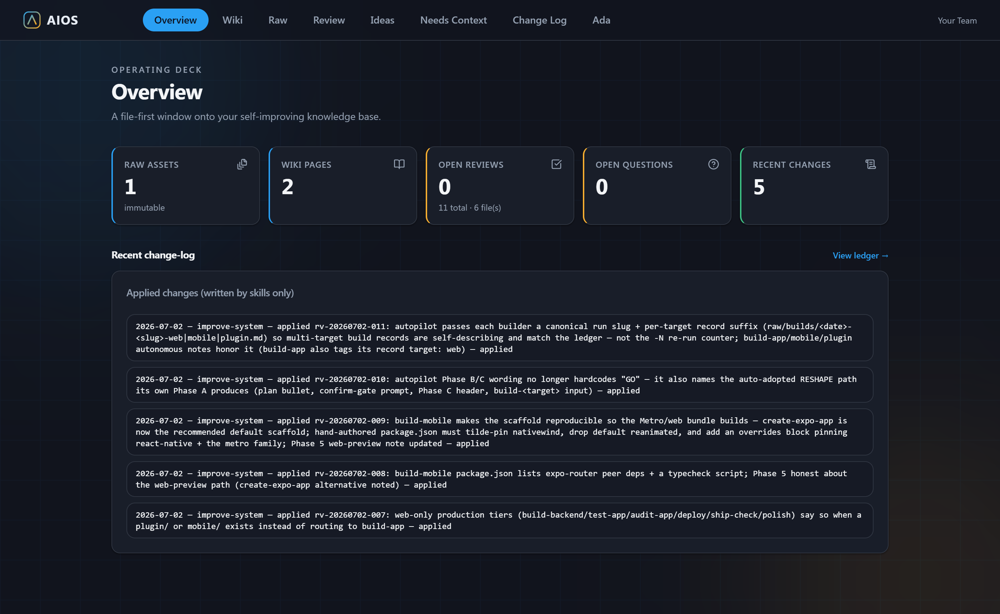
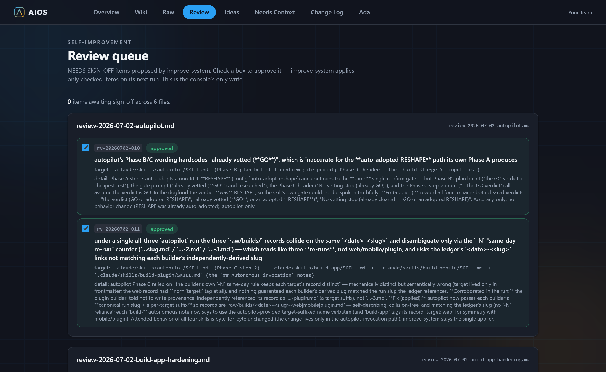

# Project Foundation

**A starter kit you copy to begin any project — a plain-English "second brain" that organizes
everything you feed it, and can carry an idea all the way to a launch-ready product.**

Think of it as an empty, *smart* notebook. You add notes, files, and links by just talking; it
files them away, keeps a tidy index, and improves itself over time. Use it for almost anything —
a business idea, a research project, a web or mobile app, a portfolio, or a growing set of notes.

When you're ready to build, it goes past a notebook: it vets your idea, designs it, builds it
(web, phone, or browser extension), then makes the data real and tests, audits, deploys, and
polishes it — one guided step at a time, always with you in control.

> 💡 **You don't need to know how to code.** You install one app — **Claude Code** — and use it with your
> own Claude plan (a paid Claude subscription); then you just talk to it in plain English and it does the
> technical parts for you. There's a little first-time setup, and **[Start here »](docs/START-HERE.md)** walks
> you through every step.

> ✅ **Dogfooded end-to-end.** The whole idea→launch chain — vetting, design, all three build targets
> (web · phone · extension), backend, tests, audit, deploy, ship-check, and polish — has been driven
> repeatedly through `autopilot` on varied sample projects (a two-sided marketplace, a fintech "get paid"
> tool, an adaptive study planner with a real scheduling engine, and more), each one built, run, and
> operated in a browser to surface the rough edges before you hit them.

---

## 🚀 Start here

Pick whichever fits you:

| You are… | Go to | What it's like |
|---|---|---|
| **New to this, or new to GitHub** | **[Start here](docs/START-HERE.md)** | The simplest path — install one app (Claude Code), and from there you mostly just talk to it in plain English; it handles the technical parts. |
| **Comfortable and want every step** | [New project walkthrough](docs/NEW-PROJECT-WALKTHROUGH.md) | The full hands-on guide: copy it, set it up, run the dashboard, pick options. |

Once you're set up, you can always type **"what can I do?"** and it'll show you a friendly menu.

> On this GitHub page, the green **Use this template** button (top of the page) makes your own
> copy. If you follow **[Start here](docs/START-HERE.md)**, the app can do that for you too.

---

## What you get

Everything below is built in from day one:

- 🧠 **A second brain** — everything you add is kept, organized, and searchable.
- 🔎 **Auto-research** — it can pull in your notes, files, and sources for you.
- 📈 **Self-learning** — repeated work turns into reusable, saved know-how.
- 🩹 **Self-healing** — it spots and proposes fixes, and **always asks before** changing anything important.
- 💡 **Proactive advisor** — it reads your usage data and proactively proposes improve, scale, and maintain ideas for you to approve (see [metrics feed](docs/METRICS-FEED.md)).
- 🧪 **Vetted before you build** — say **"/roast"** and a council of expert "advisors" pressure-tests your idea, returns a clear **go / reshape / stop** verdict plus the cheapest way to test it, and can back it with a fact-checked research briefing — so you don't pour time into the wrong thing (see [idea vetting](docs/IDEA-VETTING.md)).
- 🎨 **Designed, not generic** — a guided design step (design-tool-provider aware) captures your look-and-feel so what you build looks intentional, not AI-default.
- 🛠️ **Built for you** — when you're ready, say **"build my app"** (web), **"build my mobile app"** (phone), or **"build my browser extension"** (Chrome) and it scaffolds a working, on-brand first version in an `app/`, `mobile/`, or `plugin/` folder — mock data first, no coding (see [web](docs/BUILD-APP.md) · [mobile](docs/BUILD-MOBILE.md) · [extension](docs/BUILD-PLUGIN.md)).
- 🚀 **Or do it all in one go** — say **"build my whole project"** and it grills you once, vets + researches the idea, confirms one plan, then builds it end-to-end hands-off — for **one platform or several** (web + phone + extension from a single run) — pausing only if the idea gets a "stop" verdict, then proposing what to build next (see [autopilot](docs/AUTOPILOT.md)).
- 🏁 **All the way to launch-ready** — after building, take it to production the same guided way: make the data real with a database + sign-in, generate a real test suite, run a security/accessibility/performance audit, scaffold hosting + CI, get a **go / not-yet** readiness verdict, then a final polish pass (real content, legal-page templates, optional payments). It scaffolds everything offline; the few keyed "go-live" steps stay yours (see [path to production](docs/PATH-TO-PRODUCTION.md)).
- 🤖 **Sharp under the hood** — the grunt work runs on a tuned fleet of specialist subagents that ships with the template (the right model per job, read-only by default), so it's cheaper, safer, and consistent (see [subagents](docs/SUBAGENTS.md)).

---

## 👀 See it in action

Mostly, you just *talk* to it. A first session tends to look like this:

> **You —** "I want to build a small app to track my freelance invoices."
> **It —** "Let's define it first — who's it for, and what would make it a success?" *(a few quick questions, then it writes your project charter)*
>
> **You —** "/roast"
> **It —** "Convening the council… **Verdict: GO.** The cheapest 48-hour test is ___." *(saves the verdict)*
>
> **You —** "Design it, then build my app."
> **It —** *captures your look-and-feel, then scaffolds a themed, working web app in `app/` you can preview in your browser*
>
> **You —** "Is it ready to ship?"
> **It —** "Running ship-check… **NOT-YET** — 3 gaps: no tests, no privacy policy, still on mock data — and the exact skill that closes each."

Type **"what can I do?"** any time for a friendly menu of everything it can do.

And there's a **console** — a file-first window onto your knowledge base and its self-improvement
queues (`cd aios && npm install && npm run dev`):

Nothing structural changes without your say-so. Proposed edits wait in a **Review queue** until you
check the box — then, and only then, the system applies them:

---

## 📚 Documentation

Every link below is clickable:

| Guide | Read it for… |
|---|---|
| [Start here](docs/START-HERE.md) | The simplest, plain-language way to begin. |
| [New project walkthrough](docs/NEW-PROJECT-WALKTHROUGH.md) | The full step-by-step — including how to pull in updates later. |
| [Using this for any project](docs/USING-THIS-FOR-ANY-PROJECT.md) | The mental model + how far to take it (the "tiers"). |
| [Building your app](docs/BUILD-APP.md) | How the system builds your app for you. |
| [Building your mobile app](docs/BUILD-MOBILE.md) | How the system builds a phone app for you. |
| [Building your browser extension](docs/BUILD-PLUGIN.md) | How the system builds a Chrome extension for you. |
| [Make data real](docs/BUILD-BACKEND.md) | Add a real Supabase backend + sign-in to your built app. |
| [Test your app](docs/TEST-APP.md) | Generate a real test suite mapped to your success criteria. |
| [Audit your app](docs/AUDIT-APP.md) | Check it's safe, accessible, and fast — a prioritized findings report. |
| [Deploy your app](docs/DEPLOY.md) | Scaffold hosting + CI + observability, then a go-live checklist. |
| [Ship-check your app](docs/SHIP-CHECK.md) | One GO / NOT-YET readiness verdict naming what's left before launch. |
| [Polish your app](docs/POLISH.md) | Real content, UX states, legal pages, docs, and optional payments — make it launch-ready. |
| [Keep your app healthy](docs/MAINTAIN-APP.md) | Scheduled, report-first maintenance for a shipped app — safe fixes only, you pull the trigger. |
| [Path to production](docs/PATH-TO-PRODUCTION.md) | The ordered map from prototype to a shippable product. |
| [Extending](docs/EXTENDING.md) | Adding your own skills, sources, tools, and pages. |
| [Subagents](docs/SUBAGENTS.md) | The tuned agent fleet that does the grunt work — and how to add your own. |
| [Autopilot](docs/AUTOPILOT.md) | Describe your goal once — it vets, designs, and builds end-to-end. |
| [Scheduling](docs/SCHEDULING.md) | Letting it run and improve itself on a schedule. |
| [Design spec](docs/superpowers/specs/2026-06-29-hma-project-foundation-design.md) | The full design, for the curious. |
| [CLAUDE.md](CLAUDE.md) | The rules the AI follows every session. |

---

## How it works (in plain terms)

1. You drop something in — a file, a note, a link.
2. It saves the original, untouched, in a safe folder.
3. It writes a short, organized summary so you can find it later.
4. Now and then it reviews everything, fixes small things, and **asks you** before bigger changes.

Three folders do the work (all clickable):

- [`raw/`](raw) — your originals, never changed.
- [`wiki/`](wiki) — the AI-written, organized index of your originals.
- [`outputs/`](outputs) — reports and the "please approve this" lists.

---

## Make it your project

This is meant to become *your* thing — a web or mobile app, a workflow, a portfolio or data
manager, a research notebook. The natural order is **define it → vet it → design it → build it →
take it to production**:

1. **Define it** — run **[`define-project`](.claude/skills/define-project/SKILL.md)**, a short discovery interview that captures your goal, audience, and success in `wiki/charter.md` so the rest of the system has a north star.
2. **Vet it** — want a gut-check before you build? Say **"/roast"** and **[`roast`](.claude/skills/roast/SKILL.md)** convenes a council that pressure-tests the idea and gives a clear **go / reshape / stop** verdict, with an optional fact-checked briefing — so you only build what's worth building.
3. **Design it** — run **[`define-design`](.claude/skills/define-design/SKILL.md)** to capture how it should *look* — a design system in `wiki/design-system.md` so your UI isn't generic.
4. **Build it** — when the plan and look are set, run **[`build-app`](.claude/skills/build-app/SKILL.md)** (or just say "build my app") and it scaffolds a working, themed first version of your web app into an `app/` folder, runnable with `npm run dev`. Prefer a phone app? Run **[`build-mobile`](.claude/skills/build-mobile/SKILL.md)** ("build my mobile app") for an Expo app in a `mobile/` folder you preview on your phone via a QR code. Prefer a browser extension? Run **[`build-plugin`](.claude/skills/build-plugin/SKILL.md)** ("build my browser extension") for a themed Manifest V3 extension in a `plugin/` folder you load into Chrome via Developer mode. All three are front-end MVPs with placeholder data — real data, accounts, and deployment come next (step 5). See [web](docs/BUILD-APP.md) · [mobile](docs/BUILD-MOBILE.md) · [extension](docs/BUILD-PLUGIN.md).
5. **Take it to production** — when the first version works, walk the six-rung [path to production](docs/PATH-TO-PRODUCTION.md): real data + sign-in with **[`build-backend`](.claude/skills/build-backend/SKILL.md)**, a real test suite with **[`test-app`](.claude/skills/test-app/SKILL.md)**, a security/accessibility/performance audit with **[`audit-app`](.claude/skills/audit-app/SKILL.md)**, hosting + CI with **[`deploy`](.claude/skills/deploy/SKILL.md)**, a **go / not-yet** readiness gate with **[`ship-check`](.claude/skills/ship-check/SKILL.md)**, and a final **[`polish`](.claude/skills/polish/SKILL.md)** pass — real content, legal templates, optional payments. Everything scaffolds offline; the few keyed "go-live" steps stay yours.

The easiest route is to let the **setup** step do it for you
(it's part of [Start here](docs/START-HERE.md)). To go deeper, see
[Using this for any project](docs/USING-THIS-FOR-ANY-PROJECT.md) and [Extending](docs/EXTENDING.md).

Smarter features are **optional and off by default** — it works fully with no keys and no extra
setup. Turn on better search, a live chat assistant, or cloud storage only if and when you want
them. Each is explained in [Using this for any project](docs/USING-THIS-FOR-ANY-PROJECT.md).

---

## 🔧 Under the hood (for the curious)

The technical reference — skip this if you just want to use it.

| Path | What it is |
|---|---|
| [`raw/`](raw) | Original, immutable ingested assets. Never edited by hand or AI. |
| [`wiki/`](wiki) | AI-written table of contents over `raw/`. Never hand-edited. |
| [`outputs/`](outputs) | Generated reports + the self-improvement approval queues. |
| [`.claude/skills/`](.claude/skills) | The skills that grow and maintain the knowledge base. |
| [`aios/`](aios) | The file-first web console (`cd aios && npm install && npm run dev`). |
| [`docs/`](docs) | All the guides + the design spec. |
| [`CLAUDE.md`](CLAUDE.md) | The operating rules the AI loads every session. |

**Build status** — all phases shipped:

- Phase 0 — knowledge foundation + `add-new-resource` ✅
- Phase 1 — ingest/sync skills + `data-ingestion` orchestrator ✅
- Phase 2 — `improve-system` + `human-improve-system` (self-healing) ✅
- Phase 3 — the `aios/` web console (file-first) ✅
- Phase 4 — optional intelligence layer (semantic search + Anthropic agent) ✅
- Phase 5 — guided `setup-project` + autonomous `maintenance-loop` (scheduling) ✅
- Phase 6 — `advise-project` proactive advisor (propose-only, rides `maintenance-loop` tick) ✅
- Phase 7 — optional `codex-review` cross-model code-review gate (graceful-off) ✅
- Phase 8 — `define-project` discovery interview → project charter (`wiki/charter.md`) ✅
- Phase 9 — `define-design` design-discovery + design system (`wiki/design-system.md`, design-tool-provider aware) ✅
- Phase 10 — `roast` + `storm-research` idea-vetting gate (vet before you build) ✅
- Phase 11 — `build-app`: turn the charter + design system into a working, themed web app (`app/`) ✅
- Phase 12 — `build-mobile`: turn the charter + design system into a themed Expo phone app (`mobile/`) ✅
- Phase 13 — `build-plugin`: turn the charter + design system into a themed Manifest V3 browser extension (`plugin/`) ✅
- Phase 14 — tuned `.claude/agents/` subagent fleet + `docs/SUBAGENTS.md` policy (model-mix + least-tools) ✅
- Phase 15 — `autopilot`: describe once → grill + vet + research + confirm → hands-off design+build (the capstone) ✅
- Phase 16 — `autopilot` multi-target: one grill builds any combination of web + mobile + plugin in a single run ✅
- Phase 17 — `autopilot` loop-aware: after building, it proposes ranked "what's next" ideas (propose-only) ✅
- Phase 18 — `build-backend`: upgrades the built web app to real data — Supabase schema + graceful-off data layer + auth + go-live checklist (offline scaffold; keyed go-live stays the user's) ✅
- Phase 19 — `test-app`: a real test suite (Vitest + Testing Library + Playwright + coverage) for the built `app/`, mapped to the charter's success criteria; adds a `test-writer` agent ✅
- Phase 20 — `audit-app`: a propose-only security + accessibility + performance audit of the built `app/` → one prioritized findings report in `outputs/audits/` (mirrors `codex-review`) ✅
- Phase 21 — `deploy` + `sync-metrics`: scaffold hosting (Vercel) + CI + graceful-off observability + a go-live checklist (you pull the trigger), and a graceful-off metrics connector that feeds `raw/metrics/` — closing the `advise-project` loop ✅
- Phase 22 — `ship-check`: a propose-only GO / NOT-YET production-readiness gate over the built `app/` (build · data · tests · audit · deploy · content · legal · charter criteria) → one verdict in `outputs/ship-check/` naming the blocking gaps (the production analog of `roast`) ✅
- Phase 23 — `polish`: a build-* pass over the built `app/` — real content, onboarding/empty/error/loading states, legal templates (privacy/terms/consent), user docs, and an opt-in graceful-off Stripe scaffold — closing rung 6, the final path-to-production rung ✅
- Phase 24 — `maintain-app`: a report-first scheduled "operate & maintain" loop (path-to-production rung 7) for a shipped `app/` — re-runs the quality signals into one health report in `outputs/maintenance/`, delegates dependency patching to Dependabot (7-day cooldown), opens gated SAFE-PRs only, and a real sentinel-scoped guard hook makes merge/deploy/publish/keys impossible for the loop (roast RESHAPE + verified storm) ✅
